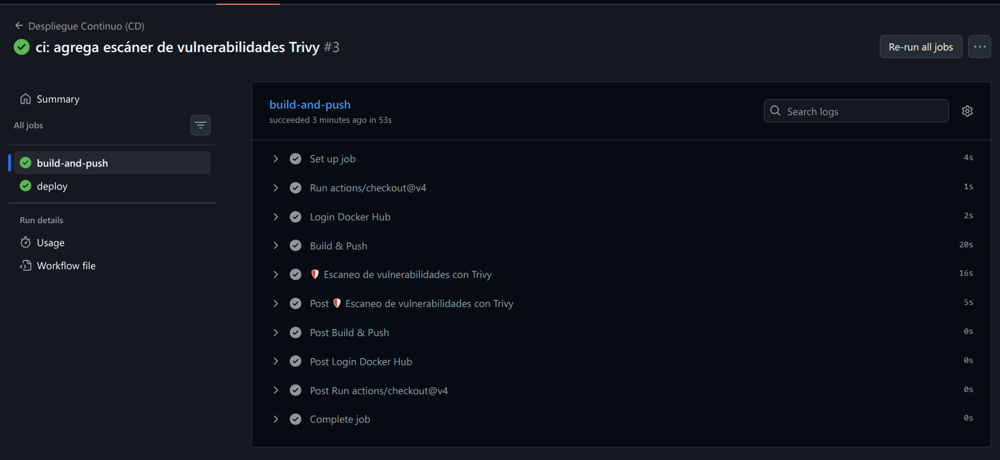
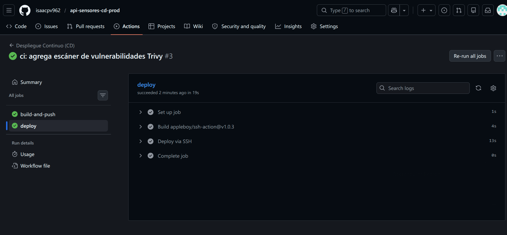
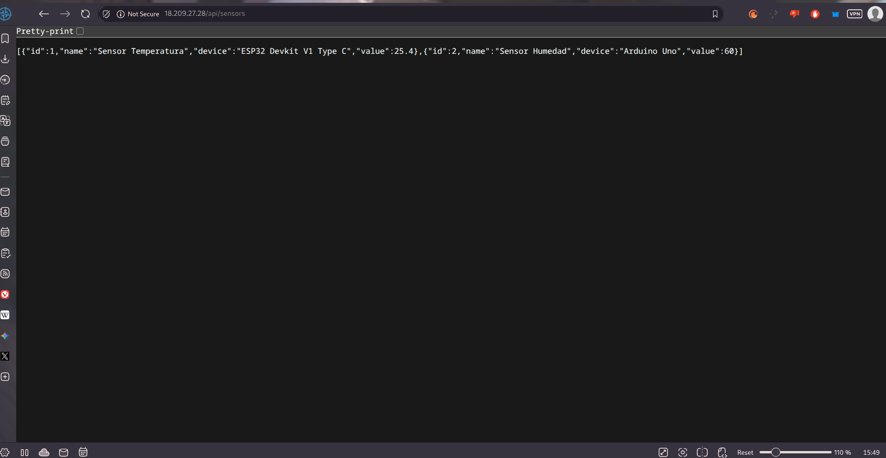
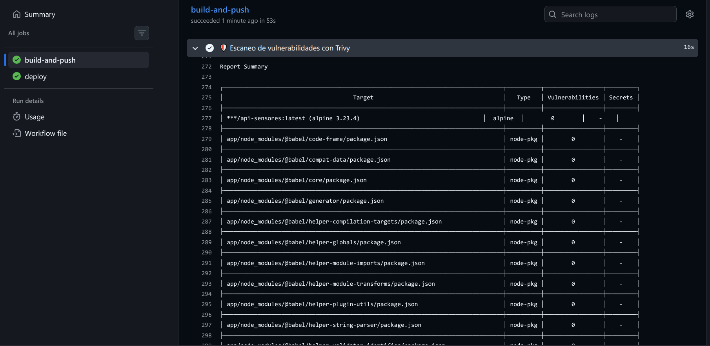

# Informe de Laboratorio 5.2: Pipeline de CD con Docker y AWS

**Estudiante:** Hernan Isaac Peñaranda Villarroel 
**Docente:** Ing. Marcelo Quispe Ortega 
**Universidad:** Universidad Mayor Real y Pontificia de San Francisco Xavier de Chuquisaca (USFX) 
**Carrera:** Ingeniería en Ciencias de la Computación

## 1. Configuración de Infraestructura
Se desplegó una instancia EC2 en AWS utilizando Ubuntu 22.04. Para la seguridad, se habilitaron los puertos 22 (administración) y 80 (servicio público).

## 2. Estrategia de Despliegue
Se utilizó un Dockerfile multi-etapa para optimizar el almacenamiento en el servidor. El pipeline automatiza:
- El empaquetado de la aplicación.
- La publicación en Docker Hub.
- La ejecución remota mediante comandos SSH para actualizar el contenedor en tiempo real.

## 3. Evidencias
- **Pipeline de CD Exitoso:**  
- **API funcionando en IP Pública:** 
- **Evidencia del escaneo de vulnerabilidades (Trivy):**
En el pipeline se integró *Trivy* para analizar la imagen de Docker antes del despliegue. Esta herramienta escaneó el sistema operativo base (Alpine Linux) y las librerías de Node.js en busca de vulnerabilidades críticas o altas (CRITICAL, HIGH). 

## 4. Rollback
Para revertir una versión, se utilizarían etiquetas específicas en lugar de `latest`. En caso de fallo, se ejecutaría:
`docker run -d --name api-iot -p 80:3000 ${{ secrets.DOCKER_USERNAME }}/api-sensores:SHA_ANTERIOR`

## 5. Reflexión sobre el uso de Contenedores y CD en Proyectos Reales

La integración de contenedores (Docker) junto con un pipeline de Despliegue Continuo (CD) proporciona ventajas fundamentales para el ciclo de vida del desarrollo de software en entornos reales:

1. **Eliminación del problema "En mi máquina funciona":** Al empaquetar la API de sensores IoT con todas sus dependencias exactas dentro de un contenedor, garantizamos que el código se comportará exactamente igual en el entorno local del desarrollador que en el servidor de producción en AWS. Esto reduce drásticamente los errores de compatibilidad.
2. **Despliegues ágiles y sin intervención manual:** La automatización elimina la necesidad de conectarse al servidor, descargar código, instalar paquetes y reiniciar servicios manualmente. Cada vez que se aprueba un cambio en la rama `main`, el nuevo código está disponible en producción en cuestión de minutos.
3. **Seguridad integrada en el proceso (DevSecOps):** Al incorporar herramientas como Trivy dentro del pipeline, el escaneo de vulnerabilidades deja de ser un proceso manual o de final de ciclo. El pipeline previene automáticamente el despliegue de imágenes con fallos de seguridad conocidos.
4. **Resiliencia y recuperación rápida:** Al etiquetar cada contenedor con un identificador único (como el hash del commit de Git), mantener un historial de versiones listas para usar permite ejecutar un *rollback* de forma casi instantánea si la nueva versión presenta fallas en producción.